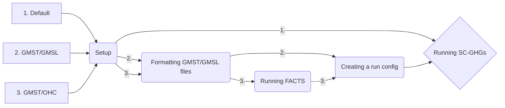

# DSCIM: The Data-driven Spatial Climate Impact Model

This repository is an implementation of DSCIM, referred to as DSCIM-FACTS-EPA, that implements the SC-GHG specification for the U.S. Environmental Protection Agency’s (EPA) September 2022 draft technical report, "Report on the Social Cost of Greenhouse Gases: Estimates Incorporating Recent Scientific Advances", and includes the option to input exogenous global mean surface temperature (GMST) and global mean sea level (GMSL) trajectories. DSCIM-FACTS-EPA currently provides instructions for installing and running the Framework for Assessing Changes To Sea-level ([FACTS](https://github.com/radical-collaboration/facts)) to obtain GMSL from GMST.

This Python library enables the calculation of sector-specific partial social cost of greenhouse gases (SC-GHG) and SC-GHGs that are combined across sectors. The main purpose of this library is to parse the monetized spatial damages from different sectors and integrate them into SC-GHGs for different discount levels, pulse years, and greenhouse gases. 

## Outline
This README is organized as follows:

- [Types of run cases](#types-of-run-cases)
- [Installation and setup of `dscim-facts-epa`](#installation-and-setup-of-dscim-facts-epa)
- [Creating a `dscim-facts-epa` run config](#creating-a-dscim-facts-epa-run-config)
- [Modifying a generated config](#modifying-the-auto-generated-config)
- [Running `dscim-facts-epa` SC-GHG command line tool out of the box](#running-sc-ghgs)
- [DSCIM + FACTS run process overview](#dscim--facts-run-process-overview)
- [Format of GMST, OHC, GMSL input files](#formatting-files)
- FACTS-specific setup
    - [Installation of `facts`](#running-facts)
      - [Docker (Windows, Mac OS)](#docker)
      - [Not Docker (Linux)](#not-docker)
    - [Running `facts` with bash run script](#running-the-bash-script)


## Types of run cases

By default, DSCIM-FACTS-EPA can run SC-GHGs for carbon dioxide, methane, and nitrous oxide for pulse years 2020-2080 in 10 year increments for the Resources for the Future socioeconomic pathways (RFF-SPs). For alternative gases or pulse years, the user can provide new GMST and GMSL trajectories. The user can provide these trajectories directly as input files, or can use the DSCIM-FACTS-EPA FACTS runner to generate GMSL from ocean heat content (OHC) and GMST. The potential use cases of this repository are thus:

1. The user wants to generate the default Climate Impact Lab (CIL) RFF SC-GHGs. _This is the same functionality as `dscim-epa`._
2. The user has alternative GMST and OHC files following the guidelines [below](#formatting-files) (usually directly from a simple climate model, such as FaIR) and wants to generate GMSL files from FACTS and use the CIL damage functions to generate SC-GHGs from those files. _This is the primary use-case of this repository._
3. The user has alternative GMST and GMSL files following the guidelines below and wants to use the CIL damage functions to generate SC-GHGs based on those files. _This is expected to be an unlikely use-case but we list it for completeness._
  


## Installation and setup of `dscim-facts-epa`

To begin, we assume you have a system with `conda` available from the command line, and some familiarity with it. A conda distribution is available from [miniconda](https://docs.conda.io/en/latest/miniconda.html), [Anaconda](https://www.anaconda.com/), or [mamba](https://mamba.readthedocs.io/en/latest/). This helps to ensure that required software packages are correctly compiled and installed, replicating the analysis environment. If you are using conda, we recommend following [this](https://www.anaconda.com/blog/a-faster-conda-for-a-growing-community) guide to speed up environment solve time.

Begin in the `dscim-facts-epa` project directory, which can be downloaded and unzipped, or cloned with `git` in a terminal. If the repository is downloaded rather than cloned, you may see a message like “fatal: not a git repository (or any of the parent directories): .git” when running the SC-GHG command line tool, which can be safely ignored. To clone the repository:

```bash
git clone https://github.com/ClimateImpactLab/dscim-facts-epa.git
```

Next, from within the root directory of `dscim-facts-epa`, set up a conda environment for this analysis. This replicates the software environment used for analysis. With `conda` from the command line this is

```bash
conda env create -f environment.yml
```

and then activate the environment with

```bash
conda activate dscim-facts-epa
```

Be sure that all commands and analyses are run from this conda environment.

With the environment set up and active, the next step is downloading the required DSCIM-FACTS-EPA input data into the local directory. Assuming you are in the `dscim-facts-epa/scripts` directory, from the command line run:

```bash
python directory_setup.py
```

Note that this will download several gigabytes of data and may take several minutes, depending on your connection speed.


## Running SC-GHGs

Default SC-GHGs (CO2, CH4, N2O for pulse years 2020, 2030, 2040, 2050, 2060, 2070, 2080) can be run once installation is complete. Alternatively, these steps can be followed using exogenous climate inputs, including GMSL produced by FACTS, to produce SC-GHGs of the users choice. Instructions for installing and running FACTS follow [here](#dscim--facts-run-process-overview).

After setting up the dscim-facts-epa environment and input data, activate the environment by typing `conda activate dscim-facts-epa`. You can run SC-GHG calculations under different conditions with or without a config file.

Assuming you are in the `dscim-facts-epa/scripts` folder, if you want to run the cil-spec (default) SC-GHGs, you can run:
```bash
python command_line_scghg.py
```

Alternatively, if you have run FACTS, or are using a GMSL file of your own, you can run:
```bash
python command_line_scghg.py name_of_config.yml
```

and follow the on-screen prompts. When the selector is a carrot, you may only select one option. Use the arrow keys on your keyboard to highlight your desired option and click enter to submit. When you are presented with `X` and `o` selectors, you may use the spacebar to select (`X`) or deselect (`o`) then click enter to submit once you have chosen your desired number of parameters. Once you have completed all of the options, the DSCIM run will begin.

<details>

<summary><b>Command line options</b></summary>

### Command line options

Below is a short summary of what each command line option does. To view a more detailed description of what the run parameters do, see the [Documentation](https://impactlab.org/research/data-driven-spatial-climate-impact-model-user-manual-version-092023-epa/) for Data-driven Spatial Climate Impact Model (DSCIM). 

#### Sector

The user may only select one sector per run. Sectors represent the combined SC-GHG or partial SC-GHGs of the chosen sector.

#### Discount rate

These runs use endogenous Ramsey discounting that are targeted to begin at the chosen near-term discount rate(s). 

#### Pulse years

Pulse year represents the SC-GHG for a pulse of greenhouse gas (GHG) emitted in the chosen pulse year(s). 

#### Domain of damages

The default is a global SC-GHG accounting for global damages in response to a pulse of GHG. The user has the option to instead limit damages to those occurring directly within the territorial United States. This is only a partial accounting of the cost of climate change to U.S. citizens and residents because it excludes international transmission mechanisms, like trade, cross-border investment and migration, damage to the assets of U.S. citizens and residents outside the United States, or consideration of how GHG emission reduction activity within the United States impacts emissions in other countries.

#### Optional files

By default, the script will produce the expected SC-GHGs as a `.csv`. The user also has the option to save the full distribution of 10,000 SC-GHGs -- across emissions, socioeconomics, and climate uncertainty -- as a `.csv`, and the option to save global consumption net of baseline climate damages ("global_consumption_no_pulse") as a netcdf `.nc4` file.
</details>

<!-- Consider adding a section that suggests a test run of the default SC-GHGs. -->

<!-- Consider splitting the next sections into their own markdown README file -->

# DSCIM + FACTS Run process overview
Ignoring environment setup for a moment, the general run process for use-case 2 -- running DSCIM-FACTS-EPA with exogenous climate inputs and using FACTS to generate GMSL from GMST and OHC files -- is summarized here. Detailed instructions for each step are provided later in the README.
 
1. Format user GMST and OHC files manually as specified earlier (See [Formatting files](#formatting-files))
<!-- Check this next one (#2) is still correct/necessary -->
2. Place formatted GMST/OHC files into `dscim-facts-epa/scripts/input/climate`
3. Set up Docker/Not Docker container/environment (see [Installing and Running FACTS](#installing-and-running-facts))
4. Edit `dscim-facts-epa/scripts/facts.runs/facts_runs.sh` script to specify pulse years, gases, and directory locations (See [Running the bash script](#running-the-bash-script))
5. Run `bash facts_runs.sh` to generatea a config file for running `dscim-facts-epa` command line tool (See [Running the bash script](#running-the-bash-script))
6. Modify the generated config from step 5 to specify gas pulse conversions (See [Modifying the auto-generated config](#modifying-the-auto-generated-config))
7. Run `dscim-facts-epa` command line tool with newly generated config (Follow steps above in [Running SC-GHGs](#running-sc-ghgs))


## Formatting files

To ensure that both `FACTS` and `dscim-facts-epa` can read new GMST, GMSL, and OHC files, a strict format must be adopted.
1. We require that there be a control and pulse version of the appropriate variable:
    - For GMST, these are `control_temperature` and `pulse_temperature`
    - For GMSL, these are `control_gmsl` and `pulse_gmsl`
    - For OHC, these are `control_ocean_heat_content` and `pulse_ocean_heat_content`
2. Any combination of gases and pulse years can be supplied. SC-GHGs will then be runnable for those gases and pulse years.
3. We expect `year` to be at minimum from 1850-2300. Climate inputs are automatically made relative to 2001-2010 in `dscim-facts-epa` to be consistent with the damage functions.
4. The `runid` dimension corresponds to the FaIR parameters and RFF-SPs crosswalk specified for EPA's September 2022 draft technical report, "Report on the Social Cost of Greenhouse Gases: Estimates Incorporating Recent Scientific Advances". Thus, each runid is associated with an RFF-SP index and a climate parameter index. We expect 10000 `runids` from 1 to 10000. The `runid` crosswalk can be obtained from [here](https://github.com/USEPA/scghg/blob/main/GIVE/input/rffsp_fair_sequence.csv)

### Converting GMST and OHC .csv files into .nc4 files
Here we provide a code example for formatting and creating DSCIM-FACTS-EPA input climate `.nc4` files from `.csv` files. It assumes the csv files (showing OHC here) have the following format (leftmost column that is unlabeled is a `pandas` index):
```
	runid	pulse_year	gas	year	control_ocean_heat_content	pulse_ocean_heat_content
281	  1	    2030	    co2	2031	75.956955	                75.956956
282	  1	    2030	    co2	2032	77.271190	                77.271191
283	  1	    2030	    co2	2033	78.616196	                78.616197
284	  1	    2030	    co2	2034	79.999884	                79.999886
285	  1	    2030	    co2	2035	81.406942	                81.406944
```
The following code should work if there is one `pulse_year` and one `gas` in the input `.csv` but may not generalize. It is meant to give a sense for how to work with the `xarray` package in Python to produce netcdf files of the correct format for DSCIM-FACTS-EPA.
```
import pandas as pd
import xarray as xr

# dictionary mapping var name in the filename to var name in the data
vardt = {"gmst":"temperature",
         "ohc": "ocean_heat_content"
        }

# loop through input variables
for var in vardt.keys():
    df = pd.read_csv(f"{var}_pulse.csv")
 
    # control variables only vary by runid and year
    ctl = df.set_index(["runid","year"])[f"control_{vardt[var]}"].to_xarray()

    # pulse variables vary by runid, year, pulse_year, and gas
    pls = df.set_index(["runid","year","pulse_year","gas"])[f"pulse_{vardt[var]}"].to_xarray()

    # merge together into one xr.Dataset before saving
    xr.merge([ctl,pls]).to_netcdf(f"{var}_pulse.nc4")
```
Below are examples of the structure of the default climate files when read in using `xarray`.
### GMST


### GMSL


### OHC


<!-- ## Creating a `dscim-facts-epa` run config
THIS SEEMS OUT OF PLACE. AND ONLY PARTS OF IT ARE NECESSARY IF FACTS WAS ALEADY RUN.

If you already have alternative GMSL and GMST files, it is recommended to run them through the `create_config.py`. This script will generate a config that will allow you to directly begin running `dscim-facts-epa` using the user-specified GMST and GMSL inputs, gases, and pulse_years. To run this script, you will need to specify your correctly formatted gmst and gmsl files:

```bash
python create_config.py --gmst_file /path/to/GMST_filename.nc4 --gmsl_file /path/to/GMSL_filename.nc4 --pulse_years pulseyear1 pulseyear2 ... --gases gas1 gas2 ...
```

Description of arguments:
- `--gmst_file`: The path to your GMST file
- `--gmsl_file`: The path to your GMSL file
- `--pulse_years`  (optional -- default: 2020): Space delimited pulse years. Pulse years must be included in the coordinates of your gmst/gmsl files
- `--gases` (optional -- default: "CO2_Fossil"): Space delimited gases. Gases must be included in the coordinates of your gmst/gmsl files

Once this config is created, the final step is to specify the "pulse conversion" for each gas. This conversion factor converts the final SC-GHG from `$ / pulse size of FaIR gas species` to `$ / tonne of GHG`. 

To do this, modify the `gas_conversions` portion of the config. By default, this is:

```
gas_conversions:
  CH4: 2.5e-08
  CO2_Fossil: 2.72916487e-10
  N2O: 6.36480131e-07
```

To add additional gases, create a new line and follow the formatting of the previous lines. New gases should match the coordinate values of your `gas` dimension in your gmst, gmsl, or ohc files. For example, the SCC default pulse size in DSCIM-FACTS-EPA is 1 GtC (1 gigatonne Carbon). To convert to $ / tonne CO2, molecular weights are used to convert C to CO2, and Gt is converted to tonnes: `1 / [((12+2*16)/12) * (1e9)] = 2.72916487e-10`

Once this is done, proceed to the **Running SC-GHGs** step. -->

## Installing and Running FACTS

If you will be running FACTS to generate GMSL, ensure you have followed the [Formatting GMST/GMSL files](#formatting-files) section above. 

We recommend installing or cloning FACTS v1.1.2 found [here](https://github.com/radical-collaboration/facts/releases/tag/v1.1.2). To get started with FACTS, we <i>copy the relevant steps from the [FACTS quick start instructions](https://fact-sealevel.readthedocs.io/en/latest/quickstart.html) here</i> and adapt for use with `dscim-facts-epa`. FACTS can be set up to run in a Docker container (recommended) or to run on a Linux workstation. After cloning the repository, expand the option for your run environment below (<b>Docker</b> or <b>Not Docker</b>) and follow the steps.

<!-- follow the [FACTS quick start instructions](https://fact-sealevel.readthedocs.io/en/latest/quickstart.html). If you are running on a Linux machine (quickstart Section 1.1), proceed to the **Not Docker** section below. If you are running in a Container (quickstart Section 1.2), proceed to the **Docker** section below. We recommend reading these sections before following the FACTS quickstart. Note that to run `facts` for DSCIM-FACTS-EPA, you will *not* need to set up the `emulandice` module in facts. -->

1. clone the FACTS repository:
```
git clone https://github.com/radical-collaboration/facts.git --branch v1.1.2
```
FACTS will be run in "global only" mode to produce GMSL outputs from GMST and OHC inputs. This does not require setting up the `facts` `emulandice` module.

<details>

<summary><b>Docker (Recommended)</b></summary>

### Docker (Recommended)
<i>The RADICAL toolkit does not support MacOS or Windows. Therefore, to run on a Mac or Windows (the latter with [Windows Subsystem for Linux; WSL2](https://learn.microsoft.com/en-us/windows/wsl/install)), you need to run within a Linux virtual machine or container. On Windows, once you have installed WSL2, type "ubuntu" in the Command Prompt to open a linux terminal for the remaining commands.

FACTS provides a [Docker](https://www.docker.com/) container in the `docker/` directory. This container provides the Linux, Python, R, and RADICAL toolkit environment needed for FACTS to run. FACTS itself does not reside within the container because of needs related to storage space for module data, persistence of changes, and writability. The instructions below assume FACTS resides outside the container in `$HOME/facts` and mounts it within the container as `/opt/facts`. At the moment, the docker environment appears to work fairly reliably when using localhost as the resource, but working with remote resources will require additional configuration.

The sandbox directory resides within the container at `/home/jovyan/radical.pilot.sandbox`. You will likely wish to keep an eye on the size of this directory if you are doing runs that involve large files.</i>

To install FACTS through Docker please follow the steps below after downloading or cloning `facts`:

2. Download modules-data:
```
wget -P facts/modules-data -i facts/modules-data/modules-data.global-only.urls.txt
```
If you don’t have `wget`, another option for file downloads is `curl`: First, make sure you are in `$HOME/facts/modules-data` and then run:
```
xargs -n 1 curl -L -O < $HOME/facts/modules-data/modules-data.global_only.urls.txt
```
Replace `$HOME/facts` with the path to your cloned or downloaded `facts` repository. This may take a few minutes depending on your connection speed. As of December 2022, the data for stable FACTS modules are available on Zenodo at https://doi.org/10.5281/zenodo.7478191 and https://doi.org/10.5281/zenodo.7478447 (note, split between two Zenodo entries because of size limitations). Because we are only doing global projections with the modules used in the Kopp et al. (2023) manuscript, this downloads only a subset of the total FACTS data. 

3. Build the docker container. Make sure the Docker application is already running first by opening the Docker application. It is also recommended to have the `dscim-facts-epa` conda environment activated when building the docker container. Then, run the following: 
```
cd facts/docker
sh develop.sh
```

This will build the Docker image from the instructions in `develop.sh`. When you run `facts`, you will first start the `facts` image, which creates a container (usually with a randomly-generated name) for running in. Outputs saved within the container do not persist once the container is deleted. Therefore, when starting the docker image, a few directories are mounted so that inputs, outputs, and logs will persist beyond the session.

4. Start the `facts` docker image:
```
docker run -it --volume=$HOME/facts:/opt/facts --volume=$HOME/dscim-facts-epa:/opt/dscim-facts-epa -w /opt/dscim-facts-epa/scripts/facts.runs facts
```

Replace `$HOME/dscim-facts-epa` and `$HOME/facts` with the path to your cloned or downloaded `dscim-facts-epa` repository and facts repository, respectively. This command will start the container, mounting the `dscim-facts-epa` directory and the `facts` directory. Once the container is running, your working directory will be `/opt/dscim-facts-epa/scripts/facts.runs`. If you additionally want to mount the radical.sandbox (recommended), the command is:

```
docker run -it --volume=$HOME/facts:/opt/facts --volume=$HOME/dscim-facts-epa:/opt/dscim-facts-epa --volume=$HOME/tmp/radical.pilot.sandbox:/home/jovyan/radical.pilot.sandbox -w /opt/dscim-facts-epa/scripts/facts.runs facts
```
Mounting the sandbox will persist the `facts` run session output logs even after the container is shutdown and deleted.

5. You are ready to run FACTS. Proceed to [Running the bash script](#running-the-bash-script)
</details>

<details>
<summary><b>Not Docker</b></summary>

### Not Docker

<i>2. Download global-only modules-data from Zenodo:
```
wget -P facts/modules-data -i facts/modules-data/modules-data.global-only.urls.txt
```

As of December 2022, the data for stable FACTS modules are available on Zenodo at https://doi.org/10.5281/zenodo.7478191 and https://doi.org/10.5281/zenodo.7478447 (note, split between two Zenodo entries because of size limitations). Because we are only doing global projections with the modules used in the Kopp et al. (2023) manuscript, this downloads only a subset of the total FACTS data. 

3. Create and activate a Python virtual environment, and install FACTS’s Python dependences in it. You can use venv, conda or virtualenv to create your Python virtual environment. See these instructions for further details. Using venv:
```
python3 -m venv ve3
. ve3/bin/activate
pip install --upgrade setuptools pip wheel
pip install radical.entk pyyaml
```
4. Test your install by running the dummy experiment:
```
cd facts
python3 runFACTS.py experiments/dummy
```
Note that all the input files for the experiment (which can be tens of GB if you are doing local sea-level projections that rely upon CMIP output) will get copied to a sandbox created for each run. If you are running FACTS using localhost as a resource, this sandbox directory is `~/radical.pilot.sandbox`. If you have space limits on your home directory, you may want to make this a symlink to a directory with fewer space limits prior to running FACTS. The task-level `.out` and `.err` files in the sandbox are key to debugging module-level code failures; thus, this sandbox is not deleted by default. However, if you wish to save space and do not need these files for debugging, you may wish to save space by deleting the subdirectories of the sandbox folder after each run.
Note that the data files for a FACTS experiment are transfered to the compute resource with each experiment run. Thus, while it might in principle be possible to run FACTS on your desktop and use a remote HPC resource, you probably don’t want to do this. Most likely, you want to install and run FACTS directly on the remote resource. At a minimum, you will want to have a fast, high-capacity network connection to the resource.
If you need to run on a HPC resource not previously configured for RADICAL-Pilot (see the RADICAL-Pilot documentation) , the resource will need to be configured. To get assistance with this, create an issue on the RADICAL-Pilot repo.</i>

5. To run FACTS outside of a docker, the user can use the `dscim-facts-epa` environment installed above. Activate the environment by typing `conda activate dscim-facts-epa` and install an additional python package:
```
pip install radical.entk==1.41.0
```
6. You are ready to run FACTS. Proceed to [Running the bash script](#running-the-bash-script)


</details>

### Running the bash script


The user must now make modifications to the `dscim-facts-epa/scripts/facts.runs/facts_runs.sh` script to ensure all files are found and run specifications are set. Those changes are:
 - if you want to rerun previous successful experiments (not recommended), change `overwrite` to 1
 - on line 8 of the script, change `pulse_years` to the desired pulse years to be run by FACTS
 - on line 9, change `gas` to the desired gases to be run by FACTS
 - on line 11, change the path to the path of your GMST file
 - on line 12, change the path to the path of your OHC file
 - on line 14, change the path to the path of your GMSL file (where you want the GMSL file to be saved)

 
 If not running in the Docker Container:
 - on line 16, change `facts_dir` to where you have cloned your FACTS repository
 - on line 17, change `dscim_facts_epa_dir` to where you have cloned this repository 

Assuming you are in the `dscim-facts-epa/scripts/facts.runs` folder run:

```bash
bash facts_runs.sh 
```

Running FACTS is a relatively memory-intensive and disk-space-intensive process. To successfully run FACTS, you will need a moderately powerful workstation (or server) with at least 32 gigabytes of computer RAM. By default, FACTS uses two CPU cores and is not particularly sensitive to clock speed or number of CPU cores. In addition, FACTS currently requires around 30 gigabytes of disk space per pulse year-gas, which means that 3 gases and 7 pulse years (a total of 22 runs including the control) will require approximately 660 gigabytes of disk space. Alternatively, one can run subsets of runs at a time and clear memory in between. To clear memory after a run has been completed, remove the subdirectories in the `~/radical.pilot.sandbox` folder.

Note that the more pulse year and gas dimensions your input climate files have, the longer this run will take as pulse year-gas combinations are run in sequence. On a fast machine, each combination can take approximately 10 minutes, meaning that for a run of 3 gases for 7 pulse years, the run will take 220 minutes. 

The run script will create the appropriate number of FACTS "experiments" (22 in the example case), run through them, and concatenate the outputs into the format expected by `dscim-facts-epa`. The output GMSL file is automatically placed in the directory specified in the `facts_runs.sh` file.

If a docker was used, exit it once the run is complete using the `exit` command. 

### Modifying the auto-generated config

Part of the `facts_runs.sh` script will automatically generate a config `.yml` file and print the filename to the terminal. If you have custom GMST and OHC files, you will need to specify the pulse size of the gas. This conversion factor converts the final SC-GHG from `$ / pulse size of FaIR gas species` to `$ / tonne of GHG`.  To do this, modify the `gas_conversions` portion of the config. By default, this is:

```
gas_conversions:
  CH4: 2.5e-08
  CO2_Fossil: 2.72916487e-10
  N2O: 6.36480131e-07
```

To add additional gases, create a new line and follow the formatting of the previous lines. New gases should match the coordinate values of your `gas` dimension in your gmst, gmsl, or ohc files. For example, the SCC default pulse size in DSCIM-FACTS-EPA is 1 GtC (1 gigatonne Carbon). To convert to $ / tonne CO2, molecular weights are used to convert C to CO2, and Gt is converted to tonnes: `1 / [((12+2*16)/12) * (1e9)] = 2.72916487e-10`

Once this is done, proceed to the [**Running SC-GHGs**](#running-sc-ghgs) step.

<!-- ## Running SC-GHGs

After setting up the dscim-facts-epa environment and input data, activate the environment by typing `conda activate dscim-facts-epa`. You can run SC-GHG calculations under different conditions with or without a config file.

Assuming you are in the `dscim-facts-epa/scripts` folder, if you want to run the cil-spec SC-GHGs, you can run:
```bash
python command_line_scghg.py
```

Alternatively, if you have run FACTS, or are using a gmsl file of your own, you can run:
```bash
python command_line_scghg.py name_of_config.yml
```

and follow the on-screen prompts. When the selector is a carrot, you may only select one option. Use the arrow keys on your keyboard to highlight your desired option and click enter to submit. When you are presented with `X` and `o` selectors, you may use the spacebar to select (`X`) or deselect (`o`) then click enter to submit once you have chosen your desired number of parameters. Once you have completed all of the options, the DSCIM run will begin.

### Command line options

Below is a short summary of what each command line option does. To view a more detailed description of what the run parameters do, see the [Documentation](https://impactlab.org/research/data-driven-spatial-climate-impact-model-user-manual-version-092023-epa/) for Data-driven Spatial Climate Impact Model (DSCIM). 

#### Sector

The user may only select one sector per run. Sectors represent the combined SC-GHG or partial SC-GHGs of the chosen sector.

#### Discount rate

These runs use endogenous Ramsey discounting that are targeted to begin at the chosen near-term discount rate(s). 

#### Pulse years

Pulse year represents the SC-GHG for a pulse of greenhouse gas (GHG) emitted in the chosen pulse year(s). 

#### Domain of damages

The default is a global SC-GHG accounting for global damages in response to a pulse of GHG. The user has the option to instead limit damages to those occurring directly within the territorial United States. This is only a partial accounting of the cost of climate change to U.S. citizens and residents because it excludes international transmission mechanisms, like trade, cross-border investment and migration, damage to the assets of U.S. citizens and residents outside the United States, or consideration of how GHG emission reduction activity within the United States impacts emissions in other countries.

#### Optional files

By default, the script will produce the expected SC-GHGs as a `.csv`. The user also has the option to save the full distribution of 10,000 SC-GHGs -- across emissions, socioeconomics, and climate uncertainty -- as a `.csv`, and the option to save global consumption net of baseline climate damages ("global_consumption_no_pulse") as a netcdf `.nc4` file. -->

## Further Information

### Creating a `dscim-facts-epa` run config
<!-- NEED TO EDIT THIS SECTION -->
If you already have alternative GMSL and GMST files, it is recommended to run them through the `create_config.py`. This script will generate a config that will allow you to directly begin running `dscim-facts-epa` using the user-specified GMST and GMSL inputs, gases, and pulse_years. To run this script, you will need to specify your correctly formatted gmst and gmsl files:

```bash
python create_config.py \
  --gmst_file /path/to/GMST_filename.nc4 \
  --gmsl_file /path/to/GMSL_filename.nc4 \
  --pulse_years pulseyear1 pulseyear2 ... \
  --gases gas1 gas2 ... \
  --input_dir /path/to/dscim-facts-epa/input \
  --output_dir /path/to/dscim-facts-epa/output \
  --config_dir /path/to/dscim-facts-epa/configs
```

Description of arguments:
  - `--gmst_file`: The path to your GMST file
  - `--gmsl_file`: The path to your GMSL file
  - `--pulse_years`  (optional -- default: 2020): Space delimited pulse years. Pulse years must be included in the coordinates of your gmst/gmsl files
  - `--gases` (optional -- default: "CO2_Fossil"): Space delimited gases. Gases must be included in the coordinates of your gmst/gmsl files
  - `--input_dir` (optional -- default: the `dscim-facts-epa/scripts/input` that the `config.py` script belongs to) path to the inputs that were installed from the `directory_setup.py` script
  - `--output_dir` (optional -- default: the `dscim-facts-epa/scripts/output` that the `config.py` script belongs to) path to the output directory where the SC-GHGs will be saved
  - `--config_dir` (optional -- default: the same directory that the `config.py` script belongs to) path to the save directory for the generated config
 
Once this config is created, the final step is to specify the "pulse conversion" for each gas by [modifying the config](#modifying-the-auto-generated-config).


#### Input Files
These files are installed during the above Setup process and take up 4.65 GB of disk space.

Climate
- Global mean surface temperature (GMST) trajectories output from FaIR: gmst_pulse.nc4
- Ocean heat content (OHC) trajectories output from FaIR: ohc_pulse.nc4
- Global mean sea level (GMSL) trajectories derived from FACTS run from the above GMST and OHC files: gmsl_pulse.nc4
- Conversion factors to convert SC-GHGs to $/tonne of GHG: conversion_v5.03_Feb072022.nc4

Econ
- RFF USA aggregated GDP and population trajectories: rff_USA_socioeconomics.nc4
- RFF global aggregated GDP and population trajectories: rff_global_socioeconomics.nc4

Damage Functions
- Files containing a set of damage function coefficients for each RFF draw for each economic sector and valuation choice.
- RFF damage function emulator weights: damage_function_weights.nc4
