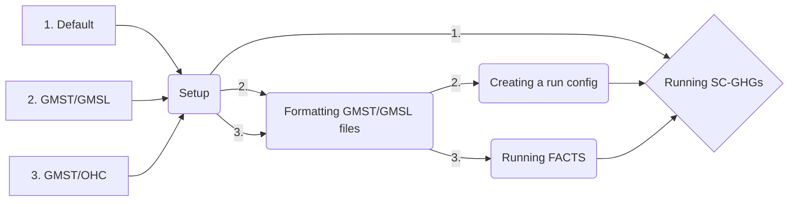

# DSCIM: The Data-driven Spatial Climate Impact Model

This repository is an implementation of DSCIM, referred to as DSCIM-FACTS-EPA, that implements the SC-GHG specification for the U.S. Environmental Protection Agency’s (EPA) September 2022 draft technical report, "Report on the Social Cost of Greenhouse Gases: Estimates Incorporating Recent Scientific Advances", and includes the option to input exogenous global mean surface temperature (GMST) and global mean sea level (GMSL) trajectories. DSCIM-FACTS-EPA currently provides instructions for installing and running the Framework for Assessing Changes To Sea-level ([FACTS](https://github.com/radical-collaboration/facts)) to obtain GMSL from GMST.

This Python library enables the calculation of sector-specific partial social cost of greenhouse gases (SC-GHG) and SC-GHGs that are combined across sectors. The main purpose of this library is to parse the monetized spatial damages from different sectors and integrate them into SC-GHGs for different discount levels, pulse years, and greenhouse gases. 

## Run cases

By default, DSCIM-FACTS-EPA can run SC-GHGs for carbon dioxide, methane, and nitrous oxide for pulse years 2020-2080 in 10 year increments for the Resources for the Future (RFF) emissions scenarios. For alternative gases or pulse years the user will need to provide new GMST and GMSL trajectories. The user can provide these trajectories directly, or can use the DSCIM-FACTS-EPA FACTS runner to generate GMSL from ocean heat content (OHC) and GMST. The intended use cases of this repository are thus:

1. The user wants to generate the Climate Impact Lab (CIL) RFF SC-GHGs themselves.
2. The user has GMST and GMSL files following the guidelines below and wants to use the CIL damage functions to generate SC-GHGs based on those files.
3. The user has GMST and OHC files following the guidelines below (usually directly from a simple climate model, such as FaIR) and wants to generate GMSL files from FACTS.
  



## Setup

To begin, we assume you have a system with `conda` available from the command line, and some familiarity with it. A conda distribution is available from [miniconda](https://docs.conda.io/en/latest/miniconda.html), [Anaconda](https://www.anaconda.com/), or [mamba](https://mamba.readthedocs.io/en/latest/). This helps to ensure that required software packages are correctly compiled and installed, replicating the analysis environment. If you are using conda, we recommend following [this](https://www.anaconda.com/blog/a-faster-conda-for-a-growing-community) guide to speed up environment solve time.

Begin in the `dscim-facts-epa` project directory, which can be downloaded and unzipped, or cloned with `git` in a terminal. For example:

```bash
git clone https://github.com/ClimateImpactLab/dscim-facts-epa.git
```

Next, from within the root directory of `dscim-facts-epa`, set up a conda environment for this analysis. This replicates the software environment used for analysis. With `conda` from the command line this is

```bash
conda env create -f environment.yml
```

and then activate the environment with

```bash
conda activate dscim-facts-epa
```

Be sure that all commands and analyses are run from this conda environment.

With the environment set up and active, the next step is downloading the required DSCIM-FACTS-EPA input data into the local directory. From the command line run:

```bash
python scripts/directory_setup.py
```

Note that this will download several gigabytes of data and may take several minutes, depending on your connection speed.

## Formatting files

To ensure that both `FACTS` and `dscim-facts-epa` can read new GMST, GMSL, and OHC files, a strict format must be adopted.
1. We require that there be a control and pulse version of the appropriate variable:
    - For GMST, these are `control_temperature` and `pulse_temperature`
    - For GMSL, these are `control_gmsl` and `pulse_gmsl`
    - For OHC, these are `control_ocean_heat_content` and `pulse_ocean_heat_content`
2. Any combination of gases and pulse years can be supplied. SC-GHGs will then be runnable for those gases and pulse years.
3. We expect `year` to be at minimum from 2000-2300. Climate inputs are automatically made relative to 2001-2010 in `dscim-facts-epa` to be consistent with the damage functions.
4. The `runid` dimension corresponds to the FaIR parameters and RFF-SPs crosswalk specified for EPA's September 2022 draft technical report, "Report on the Social Cost of Greenhouse Gases: Estimates Incorporating Recent Scientific Advances". Thus, each runid is associated with an RFF-SP index and a climate parameter index. We expect 10000 `runids` from 1 to 10000

### GMST


### GMSL


### OHC


## Creating a `dscim-facts-epa` run config

If you already have alternative GMSL and GMST files, it is recommended to run them through the `create_config.py` script to ensure that the files are formatted correctly. In addition, this script will generate a config that will allow you to directly begin running `dscim-facts-epa` using the user-specified GMST and GMSL inputs. To run this script, you will need to specify your correctly formatted gmst and gmsl files:

```bash
create_config.py --gmst_file [GMST file] --gmsl_file [GMSL file]
```

Once this config is created, you can proceed to the **Running SC-GHGs** step.

## Running FACTS

If you will be running FACTS, ensure you have followed the **Formatting GMST/GMSL files** section above. We recommend installing or cloning FACTS v1.1.1 found [here](https://github.com/radical-collaboration/facts/releases/tag/v1.1.1). To get started with FACTS, follow the [FACTS quick start instructions](https://fact-sealevel.readthedocs.io/en/latest/quickstart.html). If you are running on a Linux machine, proceed to the **Not Docker** section, otherwise proceed to the **Docker** section.

### Docker

If you are using a docker, you will need to additionally mount the `dscim-facts-epa` directory by modifying the command in the facts quickstart to:

```bash
docker run -it --volume=$HOME/facts:/opt/facts --volume=$HOME/dscim-facts-epa:/opt/dscim-facts-epa -w /opt/dscim-facts-epa/scripts/facts.runs facts
```
Replace `$HOME/dscim-facts-epa` and `$HOME/facts` with the path to your cloned `dscim-facts-epa` repository and facts repository, respectively. Now proceed to the **Running the bash script** step.

### Not Docker

To run FACTS outside of a docker, the user can use the `dscim-facts-epa` environment installed above. Activate the environment by typing `conda activate dscim-facts-epa` and install an additional python package:

```bash
pip install radical.entk==1.41.0
```

and proceed to the next section.

### Running the bash script

The user must now make modifications to the `scripts/facts.runs/facts_runs.sh` script to ensure all files are found and run specifications are set. Those changes are:
 - on line 3 of the script, change `pulse_years` to the desired pulse years to be run by FACTS
 - on line 4, change `gas` to the desired gases to be run by FACTS
 - on line 5, change `facts_dir` to where you have cloned your FACTS repository. Both this directory and the dscim-facts-epa directory will not need to be set if you are running in a docker
 - on line 5, change `dscim_facts_epa_dir` to where you have cloned this repository 

Now run:

```bash
bash facts_runs.sh 
```

Running FACTS is a relatively memory-intensive and disk-space-intensive process. To successfully run FACTS, you will need a moderately powerful workstation (or server) with at least 32 gigabytes of computer RAM. By default, FACTS uses two CPU cores and is not particularly sensitive to clock speed or number of CPU cores. In addition, FACTS currently requires around 30 gigabytes of disk space per pulse year-gas, which means that 3 gases and 7 pulse years (a total of 22 runs including the control) will require approximately 660 gigabytes of disk space. Alternatively, one can run subsets of runs at a time and clear memory in between. To clear memory after a run has been completed, remove the subdirectories in the `~/radical.pilot.sandbox` folder.

Note that the more pulse year and gas dimensions your input climate files have, the longer this run will take as pulse year-gas combinations are run in sequence. On a fast machine, each combination can take approximately 10 minutes, meaning that for a run of 3 gases for 7 pulse years, the run will take 220 minutes. The run script will create the appropriate number of FACTS "experiments" (22 in the example case), run through them, and concatenate the outputs into the format expected by `dscim-facts-epa`.

If a docker was used, exit it once the run is complete using the `exit` command.

## Running SC-GHGs

After setting up the dscim-facts-epa environment and input data, activate the environment by typing `conda activate dscim-facts-epa`. You can run SC-GHG calculations under different conditions with or without a config file.

If you want to run the cil-spec SC-GHGs, you can run:
```bash
python scripts/command_line_scghg.py
```

Alternatively, if you have run FACTS, or are using a gmsl file of your own, you can run:
```bash
python scripts/command_line_scghg.py name_of_config.yml
```

and follow the on-screen prompts. When the selector is a carrot, you may only select one option. Use the arrow keys on your keyboard to highlight your desired option and click enter to submit. When you are presented with `X` and `o` selectors, you may use the spacebar to select (`X`) or deselect (`o`) then click enter to submit once you have chosen your desired number of parameters. Once you have completed all of the options, the DSCIM run will begin.

### Command line options

Below is a short summary of what each command line option does. To view a more detailed description of what the run parameters do, see the [Documentation](https://impactlab.org/research/dscim-user-manual-version-092023-epa) for Data-driven Spatial Climate Impact Model (DSCIM). 

#### Sector

The user may only select one sector per run. Sectors represent the combined SC-GHG or partial SC-GHGs of the chosen sector.

#### Discount rate

These runs use endogenous Ramsey discounting that are targeted to begin at the chosen near-term discount rate(s). 

#### Pulse years

Pulse year represents the SC-GHG for a pulse of greenhouse gas (GHG) emitted in the chosen pulse year(s). 

#### Domain of damages

The default is a global SC-GHG accounting for global damages in response to a pulse of GHG. The user has the option to instead limit damages to those occurring directly within the territorial United States. This is only a partial accounting of the cost of climate change to U.S. citizens and residents because it excludes international transmission mechanisms, like trade, cross-border investment and migration, damage to the assets of U.S. citizens and residents outside the United States, or consideration of how GHG emission reduction activity within the United States impacts emissions in other countries.

#### Optional files

By default, the script will produce the expected SC-GHGs as a `.csv`. The user also has the option to save the full distribution of 10,000 SC-GHGs -- across emissions, socioeconomics, and climate uncertainty -- as a `.csv`, and the option to save global consumption net of baseline climate damages ("global_consumption_no_pulse") as a netcdf `.nc4` file.

## Further Information

#### Input Files
These files are installed during the above Setup process and take up 4.65 GB of disk space.

Climate
- Global mean surface temperature (GMST) trajectories output from FaIR: gmst_pulse.nc
- Global mean sea level (GMSL) trajectories derived from FaIR GMST: gmsl_pulse.zarr
- Conversion factors to convert SC-GHGs to $/tonne of GHG: conversion_v5.03_Feb072022.nc4

Econ
- RFF USA aggregated GDP and population trajectories: rff_USA_socioeconomics.nc4
- RFF global aggregated GDP and population trajectories: rff_global_socioeconomics.nc4

Damage Functions
- Files containing a set of damage function coefficients for each RFF draw for each economic sector and valuation choice.
- RFF damage function emulator weights: damage_function_weights.nc4

