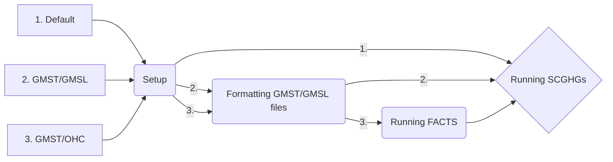

# DSCIM: The Data-driven Spatial Climate Impact Model

This repository is an implementation of DSCIM, referred to as DSCIM-FACTS-EPA, that implements the SC-GHG specification for the U.S. Environmental Protection Agency’s (EPA) September 2022 draft technical report, "Report on the Social Cost of Greenhouse Gases: Estimates Incorporating Recent Scientific Advances", and includes the option to input exogenous global mean surface temperature (GMST) and global mean sea level (GMSL) trajectories. DSCIM-FACTS-EPA currently provides instructions for installing and running the Framework for Assessing Changes To Sea-level ([FACTS](https://github.com/radical-collaboration/facts)) to obtain GMSL from GMST. 

This Python library enables the calculation of sector-specific partial social cost of greenhouse gases (SC-GHG) and SC-GHGs that are combined across sectors. The main purpose of this library is to parse the monetized spatial damages from different sectors and integrate them into SC-GHGs for different discount levels, pulse years, and greenhouse gases. 

## Run cases

By default, DSCIM-FACTS-EPA can run SC-GHGs for carbon dioxide, methane, and nitrous oxide for pulse years 2020-2080 in 10 year increments for the Resources for the Future (RFF) emissions scenarios. For alternative gases, pulse years, or emissions scenarios the user will need to provide new GMST and GMSL trajectories. The user can provide these trajectories directly, or can use the DSCIM-FACTS-EPA FACTS runner to generate GMSL from ocean heat content (OHC) and GMST. The intended use cases of this repository are thus:

1. The user wants to generate the Climate Impact Lab (CIL) RFF SC-GHGs themselves.
2. The user has GMST and GMSL files and wants the use the CIL damage functions to generate SC-GHGs based on those files.
3. The user has GMST and OHC files (usually directly from a simple climate model, such as FaIR) and wants to generate GMSL files from FACTS.
  



## Setup

To begin we assume you have a system with `conda` available from the command line, and some familiarity with it. A conda distribution is available from [miniconda](https://docs.conda.io/en/latest/miniconda.html), [Anaconda](https://www.anaconda.com/), or [mamba](https://mamba.readthedocs.io/en/latest/). This helps to ensure required software packages are correctly compiled and installed, replicating the analysis environment.

Begin in the `dscim-facts-epa` project directory. If needed this can be downloaded and unzipped, or cloned with `git`. For example

```bash
git clone https://github.com/ClimateImpactLab/dscim-facts-epa.git
```

Next, setup a conda environment for this analysis. This replicates the software environment used for analysis. With `conda` from the command line this is

```bash
conda env create -f environment.yml
```

and then activate the environment with

```bash
conda activate dscim-facts-epa
```

Be sure that all commands and analysis are run from this conda environment.

With the environment setup and active, the next step is to download required input data into the local directory. From the command line run:

```bash
python scripts/directory_setup.py
```

Note that this will download several gigabytes of data and may take several minutes, depending on your connection speed.

## Formatting files

This section will describe where exactly to put the GMST/GMSL/OHC files and how exactly each should be formatted.

### GMST

### GMSL

### OHC

## Running FACTS

If you will be running FACTS, make sure that you have followed the **Formatting GMST/GMSL files** section above. To get started with FACTS, follow the [FACTS quick start instructions](https://fact-sealevel.readthedocs.io/en/latest/quickstart.html). ##This assumes that the repository of FACTS is in the same directory as this repository. Likewise, we need to make sure that the FACTS environment can be found by this script (maybe we just make it on the fly)##. Once you have done so, run

```bash
bash repos/dscim-facts-epa/scripts/facts.runs/facts_runs.sh 
```

Keep in mind that the more pulse year and gas dimensions your files have, the longer this run will take. On a fast machine each combination can take in the neighborhood of 10 minutes, meaning that for a run of 3 gases for 7 pulse years, the run will take 3x(7 + 1)x10 = 240 minutes.


## Running SCGHGs

After setting up your environment and the input data, you can run SCGHG calculations under different conditions with

```bash
python scripts/command_line_scghg.py
```

and follow the on-screen prompts. When the selector is a carrot, you may only select one option. Use the arrow keys on your keyboard to highlight your desired option and click enter to submit. When you are presented with `X` and `o` selectors, you may use the spacebar to select (`X`) or deselect (`o`) then click enter to submit once you have chosen your desired number of parameters. Once you have completed all of the options, the DSCIM run will begin.

### Command line options

Below is a short summary of what each command line option does. To view a more detailed description of what the run parameters do, see the [Documentation](https://impactlab.org/research/dscim-user-manual-version-092023-epa) for Data-driven Spatial Climate Impact Model (DSCIM). 

#### Sector

The user may only select one sector per run. Sectors represent the combined SC-GHG or partial SC-GHGs of the chosen sector.

#### Discount rate

These runs use endogenous Ramsey discounting that are targeted to begin at the chosen near-term discount rate(s). 

#### Pulse years

Pulse year represents the SC-GHG for a pulse of greenhouse gas (GHG) emitted in the chosen pulse year(s). 

#### Domain of damages

The default is a global SC-GHG accounting for global damages in response to a pulse of GHG. The user has the option to instead limit damages to those occurring directly within the territorial United States. This is only a partial accounting of the cost of climate change to U.S. citizens and residents because it excludes international transmission mechanisms, like trade, cross-border investment and migration, damage to the assets of U.S. citizens and residents outside the United States, or consideration of how GHG emission reduction activity within the United States impacts emissions in other countries.

#### Optional files

By default, the script will produce the expected SC-GHGs as a `.csv`. The user also has the option to save the full distribution of 10,000 SC-GHGs -- across emissions, socioeconomics, and climate uncertainty -- as a `.csv`, and the option to save global consumption net of baseline climate damages ("global_consumption_no_pulse") as a netcdf `.nc4` file.

## Further Information

#### Input Files
These files are installed during the above Setup process and take up 4.65 GB of disk space.

Climate
- Global mean surface temperature (GMST) trajectories output from FaIR: gmst_pulse.nc
- Global mean sea level (GMSL) trajectories derived from FaIR GMST: gmsl_pulse.zarr
- Conversion factors to convert SC-GHGs to $/tonne of GHG: conversion_v5.03_Feb072022.nc4

Econ
- RFF USA aggregated GDP and population trajectories: rff_USA_socioeconomics.nc4
- RFF global aggregated GDP and population trajectories: rff_global_socioeconomics.nc4

Damage Functions
- Files containing a set of damage function coefficients for each RFF draw for each economic sector and valuation choice.
- RFF damage function emulator weights: damage_function_weights.nc4

