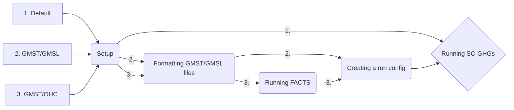

# DSCIM: The Data-driven Spatial Climate Impact Model

This repository is an implementation of DSCIM, referred to as DSCIM-FACTS-EPA, which updates the [DSCIM-EPA](https://github.com/ClimateImpactLab/dscim-epa) implementation of the SC-GHG specification for the U.S. Environmental Protection Agency’s (EPA) 2023 technical report, "Report on the Social Cost of Greenhouse Gases: Estimates Incorporating Recent Scientific Advances". It includes the option to input exogenous global mean surface temperature (GMST) and global mean sea level (GMSL) trajectories. DSCIM-FACTS-EPA currently provides instructions for installing and running the Framework for Assessing Changes To Sea-level ([FACTS](https://github.com/radical-collaboration/facts)) to obtain GMSL from GMST and ocean heat content (OHC).

This Python application enables the calculation of sector-specific partial social cost of greenhouse gases (SC-GHG) and SC-GHGs that are combined across sectors. The main purpose is to parse the monetized spatial damages from different sectors and integrate them into SC-GHGs for different discount levels, pulse years, and greenhouse gases. 

## Outline
This README is organized as follows:

- [Types of run cases](#types-of-run-cases)
- [Installation and setup of `dscim-facts-epa`](#installation-and-setup-of-dscim-facts-epa)
- [Running `dscim-facts-epa` SC-GHG command line tool out of the box](#running-sc-ghgs)
- [Running `dscim-facts-epa` SC-GHGs in batch mode](#running-sc-ghgs-in-batch-mode)
- [DSCIM + FACTS run process overview](#dscim--facts-run-process-overview)
- [Format of GMST, OHC, GMSL input files](#formatting-files)
- FACTS-specific setup
    - [Installation of `facts`](#installing-and-running-facts)
      - [Docker (Windows, Mac OS)](#docker)
      - [Not Docker (Linux)](#not-docker)
    - [Running `facts` with bash run script](#running-the-bash-script)
- [Modifying a generated config](#modifying-the-auto-generated-config)
- [Further Information](#further-information)
    - [Creating a `dscim-facts-epa` run config](#creating-a-dscim-facts-epa-run-config)
    - [Input files](#input-files)
- [Damage function coefficients](#damage-function-coefficients)

## Types of run cases

By default, DSCIM-FACTS-EPA can run SC-GHGs for carbon dioxide, methane, and nitrous oxide for pulse years 2020-2080 in 10 year increments for the Resources for the Future socioeconomic pathways (RFF-SPs). For alternative gases or pulse years, the user can provide new GMST and GMSL trajectories. The user can provide these trajectories directly as input files, or can use the DSCIM-FACTS-EPA FACTS runner to generate GMSL from ocean heat content (OHC) and GMST. The potential use cases of this repository are thus:

1. The user wants to generate the default Climate Impact Lab (CIL) RFF SC-GHGs. _This is the same functionality as `dscim-epa`._
2. The user has alternative GMST and OHC files following the guidelines [below](#formatting-files) (usually directly from a simple climate model, such as FaIR) and wants to generate GMSL files from FACTS and use the CIL damage functions to generate SC-GHGs from those files. _This is the primary use-case of this repository._
3. The user has alternative GMST and GMSL files following the guidelines below and wants to use the CIL damage functions to generate SC-GHGs based on those files. _This is expected to be an unlikely use-case but we list it for completeness._
  

```mermaid
flowchart LR

A[1. Default] --> D(Setup)
D --> |1.| E{Running SC-GHGs}

B[2. GMST/GMSL] --> D(Setup)
D --> |2.| F(Formatting GMST/GMSL files)
F --> |2.| H(Creating a run config)

C[3. GMST/OHC] --> D(Setup)
D --> |3.| F(Formatting GMST/GMSL files)
F --> |3.| G(Running FACTS)
G --> |3.| H(Creating a run config)
H --> E{Running SC-GHGs}
```

## Installation and setup of `dscim-facts-epa`

To begin, we assume you have a system with `conda` available from the command line, and some familiarity with it. A conda distribution is available from [miniconda](https://docs.conda.io/en/latest/miniconda.html) or [Anaconda](https://www.anaconda.com/). This helps to ensure that required software packages are correctly compiled and installed.

Begin in the `dscim-facts-epa` project directory, which can be downloaded and unzipped, or cloned with `git` in a terminal. If the repository is downloaded rather than cloned, you may see a message like “fatal: not a git repository (or any of the parent directories): .git” when running the SC-GHG command line tool, which can be safely ignored. To clone the repository:

```bash
git clone https://github.com/ClimateImpactLab/dscim-facts-epa.git
```

Next, from within the root directory of `dscim-facts-epa`, set up a conda environment for this analysis. This replicates the software environment used for analysis. With `conda` from the command line this is

```bash
conda env create -f environment.yml
```

and then activate the environment with

```bash
conda activate dscim-facts-epa
```

Be sure that all commands and analyses are run from this conda environment.

With the environment set up and active, the next step is downloading the required DSCIM-FACTS-EPA input data into the local directory. Assuming you are in the `dscim-facts-epa/scripts` directory, from the command line run:

```bash
python directory_setup.py
```

Note that this will download several gigabytes of data and may take several minutes, depending on your connection speed.


## Running SC-GHGs

Default SC-GHGs (CO2, CH4, N2O for pulse years 2020, 2030, 2040, 2050, 2060, 2070, 2080) can be run once installation is complete. Alternatively, these steps can be followed using exogenous climate inputs, including GMSL produced by FACTS, to produce SC-GHGs of the users choice. Instructions for installing and running FACTS follow [here](#dscim--facts-run-process-overview).

After setting up the dscim-facts-epa environment and input data, if not already active, activate the environment by typing `conda activate dscim-facts-epa`. You can run SC-GHG calculations under different conditions with or without a config file.

Assuming you are in the `dscim-facts-epa/scripts` folder, if you want to run the CIL spec (default) SC-GHGs, you can run:
```bash
python command_line_scghg.py
```

Alternatively, if you have run FACTS, or are using a GMSL file of your own, you can run:
```bash
python command_line_scghg.py name_of_config.yml
```

and follow the on-screen prompts. When the selector is a carrot, you may only select one option. Use the arrow keys on your keyboard to highlight your desired option and click enter to submit. When you are presented with `X` and `o` selectors, you may use the spacebar to select (`X`) or deselect (`o`) then click enter to submit once you have chosen your desired number of parameters. Once you have completed all of the options, the DSCIM run will begin.

<details>

<summary><b>Command line options</b></summary>

### Command line options

Below is a short summary of what each command line option does. To view a more detailed description of what the run parameters do, see the [Documentation](https://impactlab.org/research/data-driven-spatial-climate-impact-model-user-manual-version-092023-epa/) for Data-driven Spatial Climate Impact Model (DSCIM). 

#### Sector

The user may only select one sector per run. Sectors represent the combined SC-GHG or partial SC-GHGs of the chosen sector.

#### Discount rate

These runs use endogenous Ramsey discounting that are targeted to begin at the chosen near-term discount rate(s). 

#### Pulse years

Pulse year represents the SC-GHG for a pulse of greenhouse gas (GHG) emitted in the chosen pulse year(s). 

#### Domain of damages

The default is a global SC-GHG accounting for global damages in response to a pulse of GHG. The user has the option to instead limit damages to those occurring directly within the territorial United States. This is only a partial accounting of the cost of climate change to U.S. citizens and residents because it excludes international transmission mechanisms, like trade, cross-border investment and migration, damage to the assets of U.S. citizens and residents outside the United States, or consideration of how GHG emission reduction activity within the United States impacts emissions in other countries.

#### Optional files

By default, the script will produce the expected SC-GHGs as a `.csv`. The user also has the option to save the full distribution of 10,000 SC-GHGs -- across emissions, socioeconomics, and climate uncertainty -- as a `.csv`, and the option to save global consumption net of baseline climate damages ("global_consumption_no_pulse") as a netcdf `.nc4` file.
</details>

<!-- Consider adding a section that suggests a test run of the default SC-GHGs. -->


## Running SC-GHGs in batch mode

DSCIM-FACTS-EPA can be run non-interactively, without using the command line tool, using `scripts/batch_scghg.py`. 

1. Modify `scripts/batch_scghg.py` to include the outputs desired from your run:
```python
    ####################
    # EDIT these parameters:
    
    # Which sectors to save out from: 
    # "combined", "coastal", "agriculture", "mortality", "energy", "labor",
    sectors = [
        "combined",
        "coastal",
        "agriculture",
        "mortality",
        "energy",
        "labor",
    ]

    # Pulse years to save out
    # pulse years should be present in climate files
    pulse_years = [
        2020,
        2030,
        2040,
        2050,
    ]

    # Target discount rates from:
    # "1.5% Ramsey", "2.0% Ramsey", "2.5% Ramsey",
    target_disc = [
        "1.5% Ramsey",
        "2.0% Ramsey",
        "2.5% Ramsey",
    ]

    # List of whether to run Global/Territory US SCGHGs
    # Can be "global", "terr_us", or both
    terr_us = ["global",]
    
    # Whether to save out global consumption no pulse
    gcnp = True

    # Whether to save out uncollapsed SCGHGs
    uncollapsed = True
    ####################
```
2. After setting up the dscim-facts-epa environment and input data, if not already active, activate the environment by typing `conda activate dscim-facts-epa`. You can run SC-GHG calculations under different conditions with or without a config file.
3. Run the SC-GHG computation. Assuming you are in the `dscim-facts-epa/scripts` folder, if you want to run the CIL spec (default) SC-GHGs, you can run:
```bash
python batch_scghg.py
```
If you have run FACTS, or are using a GMSL file of your own, make sure to edit the script to point to the correct config file before running the above command: 
```python
    ####################
    # EDIT path and filename to config if necessary.
    # Path to the config for this run. Default is "current working directory", cwd
    conf_name = "generated_conf.yml"
    fullpath = Path(os.getcwd()) / conf_name
    conf = read_replace_conf(fullpath)

```

<!-- Consider splitting the next sections into their own markdown README file -->


# DSCIM + FACTS Run process overview
Ignoring environment setup for a moment, the general run process for use-case 2 -- running DSCIM-FACTS-EPA with exogenous climate inputs and using FACTS to generate GMSL from GMST and OHC files -- is summarized here. Detailed instructions for each step are provided later in the README.
 
1. Format user GMST and OHC files manually (See [Formatting files](#formatting-files))
<!-- Check this next one (#2) is still correct/necessary -->
2. Place formatted GMST/OHC files into `dscim-facts-epa/scripts/input/climate`
3. Set up Docker/Not Docker container/environment (see [Installing and Running FACTS](#installing-and-running-facts))
4. Edit `dscim-facts-epa/scripts/facts.runs/facts_runs.sh` script to specify pulse years, gases, and directory locations (See [Running the bash script](#running-the-bash-script))
5. Run `bash facts_runs.sh` to generate a config file for running `dscim-facts-epa` command line tool (See [Running the bash script](#running-the-bash-script))
6. Modify the generated config from step 5 to specify gas pulse conversions (See [Modifying the auto-generated config](#modifying-the-auto-generated-config))
7. Run `dscim-facts-epa` command line tool with newly generated config (Follow steps above in [Running SC-GHGs](#running-sc-ghgs))


## Formatting files

To ensure that both `FACTS` and `dscim-facts-epa` can read new GMST, GMSL, and OHC files, a strict format must be adopted.
1. We require that there be a control and pulse version of the appropriate variable:
    - For GMST, these are `control_temperature` and `pulse_temperature`
    - For GMSL, these are `control_gmsl` and `pulse_gmsl`
    - For OHC, these are `control_ocean_heat_content` and `pulse_ocean_heat_content`
2. Any combination of gases and pulse years can be supplied. SC-GHGs will then be runnable for those gases and pulse years.
3. We expect `year` to be at minimum covering 1850-2300 for FACTS input files, GMST and OHC. In `facts`, GMST and OHC are rebased to the appropriate reference period. The GMSL output produced by FACTS is 2010-2300 and is already relative to the appropriate base period for `dscim-facts-epa` GMSL damage functions (1990-2009). In `dscim-facts-epa`, GMST is automatically made relative to 2001-2010 to be consistent with the damage functions.
4. The `runid` dimension corresponds to the FaIR parameters and RFF-SPs crosswalk specified for EPA's September 2022 draft technical report, "Report on the Social Cost of Greenhouse Gases: Estimates Incorporating Recent Scientific Advances". Thus, each runid is associated with an RFF-SP index and a climate parameter index. We expect 10000 `runids` from 1 to 10000. The `runid` crosswalk can be obtained from [here](https://github.com/USEPA/scghg/blob/main/GIVE/input/rffsp_fair_sequence.csv)

### Converting GMST and OHC .csv files into NetCDF4 (.nc4) files
Here we provide a code example for formatting and creating DSCIM-FACTS-EPA input climate `.nc4` files from `.csv` files. It assumes the csv files (showing OHC here) have the following format (leftmost column that is unlabeled is a `pandas` index):
```
	runid	pulse_year	gas	year	control_ocean_heat_content	pulse_ocean_heat_content
281	  1	    2030	    co2	2031	75.956955	                75.956956
282	  1	    2030	    co2	2032	77.271190	                77.271191
283	  1	    2030	    co2	2033	78.616196	                78.616197
284	  1	    2030	    co2	2034	79.999884	                79.999886
285	  1	    2030	    co2	2035	81.406942	                81.406944
```
The following code should work if there is one `pulse_year` and one `gas` in the input `.csv` but may not generalize. It is meant to give a sense for how to work with the `xarray` package in Python to produce netcdf files of the correct format for DSCIM-FACTS-EPA.
```python
import pandas as pd
import xarray as xr

# dictionary mapping var name in the filename to var name in the data
vardt = {"gmst":"temperature",
         "ohc": "ocean_heat_content"
        }

# loop through input variables
for var in vardt.keys():
    df = pd.read_csv(f"{var}_pulse.csv")
 
    # control variables only vary by runid and year
    ctl = df.set_index(["runid","year"])[f"control_{vardt[var]}"].to_xarray()

    # pulse variables vary by runid, year, pulse_year, and gas
    pls = df.set_index(["runid","year","pulse_year","gas"])[f"pulse_{vardt[var]}"].to_xarray()

    # merge together into one xr.Dataset before saving
    xr.merge([ctl,pls]).to_netcdf(f"{var}_pulse.nc4")
```
Below are examples of the structure of the default climate files when read in using `xarray`.
### GMST


### GMSL


### OHC


## Installing and Running FACTS

If you will be running FACTS to generate GMSL, ensure you have followed the [Formatting GMST/GMSL files](#formatting-files) section above. 

We recommend installing or cloning FACTS v1.1.2 found [here](https://github.com/radical-collaboration/facts/releases/tag/v1.1.2). We copy the relevant steps from the [FACTS quick start instructions](https://fact-sealevel.readthedocs.io/en/latest/quickstart.html) here and adapt for use with `dscim-facts-epa`. FACTS can be set up to run in a Docker container (recommended) or to run on a Linux workstation. After cloning the repository, expand the option for your run environment below (<b>Docker</b> or <b>Not Docker</b>) and follow the steps.

1. clone the FACTS repository:
```
git clone https://github.com/radical-collaboration/facts.git --branch v1.1.2
```
FACTS will be run in "global only" mode to produce GMSL outputs from GMST and OHC inputs. This does not require setting up the `facts` `emulandice` module.

<details>

<summary><b>Docker (Recommended)</b></summary>

### Docker (Recommended)
The RADICAL toolkit does not support MacOS or Windows. Therefore, to run on a Mac or Windows (the latter with [Windows Subsystem for Linux; WSL2](https://learn.microsoft.com/en-us/windows/wsl/install)), you need to run within a Linux virtual machine or container. On Windows, once you have installed WSL2, type "ubuntu" in the Command Prompt to open a linux terminal for the remaining commands. For both Windows and Mac, we recommend installing [Docker Desktop](https://docs.docker.com/engine/install/), which should be opened prior to the following steps.

FACTS provides a [Docker](https://www.docker.com/) container in the `docker/` directory. This container provides the Linux, Python, R, and RADICAL toolkit environment needed for FACTS to run. FACTS itself does not reside within the container because of needs related to storage space for module data, persistence of changes, and writability. The instructions below assume FACTS resides outside the container in `$HOME/facts` and mounts it within the container as `/opt/facts`. At the moment, the docker environment appears to work fairly reliably when using localhost as the resource, but working with remote resources will require additional configuration.

The sandbox directory resides within the container's HOME directory at `/home/jovyan/radical.pilot.sandbox`. You will likely wish to keep an eye on the size of this directory if you are doing runs that involve large files.

To install FACTS through Docker please follow the steps below after downloading or cloning `facts`:

2. Download modules-data:
```
wget -P facts/modules-data -i facts/modules-data/modules-data.global_only.urls.txt
```
If you don’t have `wget`, another option for file downloads is `curl`: First, make sure you are in `$HOME/facts/modules-data` and then run:
```
xargs -n 1 curl -L -O < $HOME/facts/modules-data/modules-data.global_only.urls.txt
```
Replace `$HOME/facts` with the path to your cloned or downloaded `facts` repository. This may take a few minutes depending on your connection speed. As of December 2022, the data for stable FACTS modules are available on Zenodo at https://doi.org/10.5281/zenodo.7478191 and https://doi.org/10.5281/zenodo.7478447 (note, split between two Zenodo entries because of size limitations). Because we are only doing global projections with the modules used in the Kopp et al. (2023) manuscript, this downloads only a subset of the total FACTS data. 

3. Build the docker container. Make sure the Docker application is already running first by opening the Docker application. It is also recommended to have the `dscim-facts-epa` conda environment activated when building the docker container, with `conda activate dscim-facts-epa`. Then, run the following: 
```
cd facts/docker
sh develop.sh
```

This will build the Docker image from the instructions in `develop.sh`. When you run `facts`, you will first start the `facts` image, which creates a container (usually with a randomly-generated name) for running in. Outputs saved within the container do not persist once the container is deleted. Therefore, when starting the docker image, a few directories are mounted so that inputs, outputs, and logs will persist beyond the session.

4. Start the `facts` docker image:
```
docker run -it --volume=$HOME/facts:/opt/facts --volume=$HOME/dscim-facts-epa:/opt/dscim-facts-epa -w /opt/dscim-facts-epa/scripts/facts.runs facts
```

Replace `$HOME/dscim-facts-epa` and `$HOME/facts` with the path to your cloned or downloaded `dscim-facts-epa` repository and facts repository, respectively. This command will start the container, mounting the `dscim-facts-epa` directory and the `facts` directory. Once the container is running, your working directory will be `/opt/dscim-facts-epa/scripts/facts.runs`. If you additionally want to mount the radical.sandbox (recommended), the command is:

```
docker run -it --volume=$HOME/facts:/opt/facts --volume=$HOME/dscim-facts-epa:/opt/dscim-facts-epa --volume=$HOME/tmp/radical.pilot.sandbox:/home/jovyan/radical.pilot.sandbox -w /opt/dscim-facts-epa/scripts/facts.runs facts
```
Mounting the sandbox will persist the `facts` run session output logs even after the container is shutdown and deleted.

5. You are ready to run FACTS. Proceed to [Running the bash script](#running-the-bash-script)
</details>

<details>
<summary><b>Not Docker</b></summary>

### Not Docker

To run outside of Docker, FACTS must be run on a Linux machine.

2. Download global-only modules-data from Zenodo:
```
wget -P facts/modules-data -i facts/modules-data/modules-data.global-only.urls.txt
```

As of December 2022, the data for stable FACTS modules are available on Zenodo at https://doi.org/10.5281/zenodo.7478191 and https://doi.org/10.5281/zenodo.7478447 (note, split between two Zenodo entries because of size limitations). Because we are only doing global projections with the modules used in the Kopp et al. (2023) manuscript, this downloads only a subset of the total FACTS data.

3. To run FACTS outside of a docker, the user can use the `dscim-facts-epa` environment installed above. Activate the environment by typing `conda activate dscim-facts-epa` and install additional python packages:
```
conda install radical.entk==1.42.0 radical.saga==1.47.0 radical.utils==1.47.0 radical.pilot==1.47.0 radical.gtod==1.47.0 -c conda-forge
```

4. Test your install by running the dummy experiment:
```
cd facts
python3 runFACTS.py experiments/dummy
```

There are known issues with the software underlying FACTS that may cause this experiment to hang or crash. For some solutions, see the page [here](scripts/facts.runs/FACTS_TROUBLESHOOTING.md)

Note that all the input files for the experiment (which can be tens of GB if you are doing local sea-level projections that rely upon CMIP output) will get copied to a sandbox created for each run. If you are running FACTS using localhost as a resource, this sandbox directory is `~/radical.pilot.sandbox`. If you have space limits on your home directory, you may want to make this a symlink to a directory with fewer space limits prior to running FACTS. The task-level `.out` and `.err` files in the sandbox are key to debugging module-level code failures; thus, this sandbox is not deleted by default. However, if you wish to save space and do not need these files for debugging, you may wish to save space by deleting the subdirectories of the sandbox folder after each run.

Note that the data files for a FACTS experiment are transferred to the compute resource with each experiment run. Thus, while it might in principle be possible to run FACTS on your desktop and use a remote HPC resource, you probably don’t want to do this. Most likely, you want to install and run FACTS directly on the remote resource. At a minimum, you will want to have a fast, high-capacity network connection to the resource.
If you need to run on a HPC resource not previously configured for RADICAL-Pilot (see the RADICAL-Pilot documentation) , the resource will need to be configured. To get assistance with this, create an issue on the RADICAL-Pilot repo.


5. You are ready to run FACTS. Proceed to [Running the bash script](#running-the-bash-script)


</details>

### Running the bash script


The user must now make modifications to the `dscim-facts-epa/scripts/facts.runs/facts_runs.sh` script to ensure all files are found and run specifications are set. Those changes are:
 - if you want to rerun previous successful experiments (not recommended), change `overwrite` to 1
 - on line 12 of the script, change `pulse_years` to the desired pulse years to be run by FACTS
 - on line 13, change `gas` to the desired gases to be run by FACTS
 - on line 15, change the path to the path of your GMST file
 - on line 16, change the path to the path of your OHC file
 - on line 18, change the path to the path of your GMSL file (where you want the GMSL file to be saved)

 
 If not running in the Docker Container:
 - on line 20, change `facts_dir` to where you have cloned your FACTS repository
 - on line 21, change `dscim_facts_epa_dir` to where you have cloned this repository 

Assuming you are in the `dscim-facts-epa/scripts/facts.runs` folder run:

```bash
bash facts_runs.sh 
```

Running FACTS is a relatively memory-intensive and disk-space-intensive process. To successfully run FACTS, you will need a moderately powerful workstation (or server) with at least 32 gigabytes of computer RAM. By default, FACTS uses two CPU cores and is not particularly sensitive to clock speed or number of CPU cores. In addition, FACTS currently requires around 30 gigabytes of disk space per pulse year-gas, which means that 3 gases and 7 pulse years (a total of 22 runs including the control) will require approximately 660 gigabytes of disk space. Alternatively, one can run subsets of runs at a time and clear memory in between. To clear memory after a run has been completed, remove the subdirectories in the `~/radical.pilot.sandbox` folder.

Note that the more pulse year and gas dimensions your input climate files have, the longer this run will take as pulse year-gas combinations are run in sequence. On a fast machine, each combination can take approximately 10 minutes, meaning that for a run of 3 gases for 7 pulse years, the run will take 220 minutes. 

The run script will create the appropriate number of FACTS "experiments" (22 in the example case), run through them, and concatenate the outputs into the format expected by `dscim-facts-epa`. The output GMSL file is automatically placed in the directory specified in the `facts_runs.sh` file.

If a docker was used, exit it once the run is complete using the `exit` command. The `facts_runs.sh` script will automatically generate a config `.yml` file and print the filename to the terminal. This is the config you will use when running the `dscim-facts-epa` SC-GHG command line tool. You will first need to specify the pulse conversion factor of the gas. To do so, proceed to the next section ([Modifying the auto-generated config](#modifying-the-auto-generated-config)).

### Modifying the auto-generated config

For any non-default gases, you will need to specify the pulse conversion factor of the gas. This conversion factor converts the final SC-GHG from `$ / pulse size of FaIR gas species` to `$ / tonne of GHG`.  To do this, modify the `gas_conversions` portion of the config. By default, this is:

```
gas_conversions:
  CH4: 2.5e-08
  CO2_Fossil: 2.72916487e-10
  N2O: 6.36480131e-07
```

To add additional gases, create a new line and follow the formatting of the previous lines. New gases should match the coordinate values of your `gas` dimension in your gmst, gmsl, or ohc files. For example, the SCC default pulse size in DSCIM-FACTS-EPA is 1 GtC (1 gigatonne Carbon). To convert to $ / tonne CO2, molecular weights are used to convert C to CO2, and Gt is converted to tonnes: `1 / [((12+2*16)/12) * (1e9)] = 2.72916487e-10`

Once this is done, proceed to the [**Running SC-GHGs**](#running-sc-ghgs) step.


## Further Information

### Creating a `dscim-facts-epa` run config
If you already have alternative GMSL and GMST files, it is recommended to run them through the `create_config.py`. This script will generate a config that will allow you to directly begin running `dscim-facts-epa` using the user-specified GMST and GMSL inputs, gases, and pulse_years. To run this script, you will need to specify your correctly formatted gmst and gmsl files:

```bash
python create_config.py \
  --gmst_file /path/to/GMST_filename.nc4 \
  --gmsl_file /path/to/GMSL_filename.nc4 \
  --pulse_years pulseyear1 pulseyear2 ... \
  --gases gas1 gas2 ... \
  --input_dir /path/to/dscim-facts-epa/input \
  --output_dir /path/to/dscim-facts-epa/output \
  --config_dir /path/to/dscim-facts-epa/configs
```

Description of arguments:
  - `--gmst_file`: The path to your GMST file
  - `--gmsl_file`: The path to your GMSL file
  - `--pulse_years`  (optional -- default: 2020): Space delimited pulse years. Pulse years must be included in the coordinates of your gmst/gmsl files
  - `--gases` (optional -- default: "CO2_Fossil"): Space delimited gases. Gases must be included in the coordinates of your gmst/gmsl files
  - `--input_dir` (optional -- default: the `dscim-facts-epa/scripts/input` that the `config.py` script belongs to) path to the inputs that were installed from the `directory_setup.py` script
  - `--output_dir` (optional -- default: the `dscim-facts-epa/scripts/output` that the `config.py` script belongs to) path to the output directory where the SC-GHGs will be saved
  - `--config_dir` (optional -- default: the same directory that the `config.py` script belongs to) path to the save directory for the generated config
 
Once this config is created, the final step is to specify the "pulse conversion" for each gas by [modifying the config](#modifying-the-auto-generated-config).


### Input Files
These files are installed during the above Setup process and take up 4.65 GB of disk space.

Climate
- Global mean surface temperature (GMST) trajectories output from FaIR: gmst_pulse.nc4
- Ocean heat content (OHC) trajectories output from FaIR: ohc_pulse.nc4
- Global mean sea level (GMSL) trajectories derived from FACTS run from the above GMST and OHC files: gmsl_pulse.nc4
- Conversion factors to convert SC-GHGs to $/tonne of GHG: conversion_v5.03_Feb072022.nc4

Econ
- RFF USA aggregated GDP and population trajectories: rff_USA_socioeconomics.nc4
- RFF global aggregated GDP and population trajectories: rff_global_socioeconomics.nc4

Damage Functions
- Files containing a set of damage function coefficients for each RFF draw for each economic sector and valuation choice.
- RFF damage function emulator weights: damage_function_weights.nc4


## Damage function coefficients

This section describes the pre-computed damage function coefficients for computing the Social Cost of Greenhouse Gases (SC-GHG) with DSCIM-FACTS-EPA. The coefficients are quadratic regressions of globally-aggregated climate damages on temperature and sea level, estimated year by year across 10,000 probabilistic socioeconomic-climate draws.

For methodological details, see [References](#references).

### Directory structure

```
damage_functions/
|
|-- damage_function_weights.nc4       # Emulator weights (see below)
|
|-- CAMEL_m1_c0.20/                   # Combined sector, global
|-- CAMEL_m1_c0.20_USA/               # Combined sector, USA
|-- agriculture/                      # Agriculture, global
|-- agriculture_USA/                  # Agriculture, USA
|-- coastal_v0.20/                    # Coastal, global
|-- coastal_v0.20_USA/                # Coastal, USA
|-- energy/                           # Energy, global
|-- energy_USA/                       # Energy, USA
|-- labor/                            # Labor, global
|-- labor_USA/                        # Labor, USA
|-- mortality_v1/                     # Mortality, global
|-- mortality_v1_USA/                 # Mortality, USA
|-- google_download/                  # (empty placeholder directories)
```

Each sector directory contains NetCDF4 files with damage function coefficients for different combinations of valuation recipe and Ramsey discount rate parameters.


### Sectors

| Directory name     | Description |
|--------------------|-------------|
| `agriculture`      | Agricultural productivity damages |
| `coastal_v0.20`    | Coastal damages from sea level rise (version 0.20) |
| `energy`           | Energy expenditure damages (heating and cooling) |
| `labor`            | Labor productivity damages |
| `mortality_v1`     | Mortality damages (version 1) |
| `CAMEL_m1_c0.20`   | **Combined**: all five sectors above, aggregated |

**CAMEL** stands for Coastal, Agriculture, Mortality, Energy, and Labor. The suffix `m1_c0.20` indicates mortality version 1 and coastal version 0.20. Mortality v1 uses VSL (Value of Statistical Life) valuation with ISO-level deaths and impact-region-level costs -- this is the EPA main specification. Coastal v0.20 is the original EPA specification using FACTS-based sea level projections (Kopp et al. 2023). CAMEL is the primary output for computing aggregate SC-GHGs.

Each sector has a `_USA` variant containing coefficients for damages restricted to the United States, used for computing territorial U.S. SC-GHGs.


### File naming convention

Files follow this pattern:

```
{recipe}_euler_ramsey_eta{eta}_rho{rho}_dfc.nc4
```

Where:

- **recipe**: The valuation approach. Either `risk_aversion` or `adding_up`.
  - `risk_aversion`: Certainty-equivalent damages accounting for risk aversion across climate and socioeconomic uncertainty. This is the primary recipe used in the EPA specification.
  - `adding_up`: A simpler approach that sums damages across regions without certainty-equivalent adjustments. Only available for the CAMEL sector.
- **euler_ramsey**: The discounting framework (Euler equation with Ramsey discounting). All files use this framework.
- **eta**: Elasticity of marginal utility of consumption (the concavity of the CRRA utility function).
- **rho**: Pure rate of time preference.

#### Available parameter combinations

| Near-term discount rate | eta     | rho     |
|------------------------|---------|---------|
| 1.5% Ramsey            | 1.016   | 0.0     |
| 2.0% Ramsey            | 1.244   | 0.002   |
| 2.5% Ramsey            | 1.421   | 0.005   |
| 3.0% Ramsey            | 1.568   | 0.008   |

These four (eta, rho) pairs correspond to the near-term certainty-equivalent discount rates described in the EPA technical report. The label (e.g. "2.0% Ramsey") is approximate and used for identification only. The actual discount rate applied in each draw varies over time because it is computed from the realized consumption growth rate of that draw, following stochastic Ramsey discounting (Section 5.1 of the DSCIM User Manual, eq. 11):

```
SDF_ky = product over tau from u to y of exp( -(rho + eta * g_c_k_tau) )
```

where `g_c_k_tau = ln(c_k_tau / c_k_tau-1)` is the consumption growth rate of draw `k` in year `tau`, and `c_k_tau` is global GDP minus climate damages in that draw and year. This is implemented in `scghg_utils.py` via `menu_item_global.uncollapsed_discount_factors`, which uses the draw-specific GDP path net of damages rather than a fixed rate.


### Data structure of coefficient files

Each `.nc4` file is a NetCDF4 dataset with the following structure.

#### Dimensions

| Dimension        | Size   | Description |
|-----------------|--------|-------------|
| `discount_type` | 1      | Discounting framework (always `"euler_ramsey"`) |
| `year`          | 281    | Year of the damage function, from 2020 to 2300 |
| `runid`         | 10,000 | RFF socioeconomic pathway draw index (1 to 10,000) |

Each `runid` corresponds to one draw from the joint distribution of socioeconomic projections (from the Resources for the Future Socioeconomic Pathways, RFF-SPv2) and climate model parameters (from FaIR). The mapping between `runid` and underlying scenario parameters is documented in the EPA technical report.

#### Variables

The data variables are the regression coefficients of the damage function. Their names correspond to the terms in the regression formula.

**Temperature-driven sectors** (agriculture, energy, labor, mortality):

| Variable               | Description |
|------------------------|-------------|
| `anomaly`              | Coefficient on the linear GMST anomaly term |
| `np.power(anomaly, 2)` | Coefficient on the squared GMST anomaly term |

**Coastal sector** (coastal_v0.20):

| Variable               | Description |
|------------------------|-------------|
| `gmsl`                 | Coefficient on the linear GMSL term |
| `np.power(gmsl, 2)`    | Coefficient on the squared GMSL term |

**Combined sector** (CAMEL_m1_c0.20):

| Variable               | Description |
|------------------------|-------------|
| `anomaly`              | Coefficient on the linear GMST anomaly term |
| `np.power(anomaly, 2)` | Coefficient on the squared GMST anomaly term |
| `gmsl`                 | Coefficient on the linear GMSL term |
| `np.power(gmsl, 2)`    | Coefficient on the squared GMSL term |


### Formulas

The damage functions are quadratic regressions (without intercept) of global damages on climate variables. For each sector, year, and SSP-growth model combination, the damage function is estimated by OLS across the 33 GCMs and 2 RCP emissions scenarios (Section 4.2 of the DSCIM User Manual, eq. 4):

```
damages_slpyj = beta1_syj * dGMST_ylp + beta2_syj * dGMST_ylp^2 + error
```

where `l` indexes the climate model, `p` the emissions scenario, `y` the year, `j` the SSP-growth model, and `dGMST` is the temperature anomaly relative to the 2001-2010 average. An analogous equation is estimated for the coastal sector with `dGMSL` in place of `dGMST`. These SSP-based damage functions are then emulated for each of the 10,000 RFF-SP draws (see Appendix B of the User Manual), producing the coefficients stored in these files.

**Temperature-driven sectors:**
```
damages = beta_anomaly * T + beta_anomaly2 * T^2
```

**Coastal sector:**
```
damages = beta_gmsl * S + beta_gmsl2 * S^2
```

**CAMEL (combined):**
```
damages = beta_anomaly * T + beta_anomaly2 * T^2 + beta_gmsl * S + beta_gmsl2 * S^2
```

Where:
- `T` is the global mean surface temperature (GMST) anomaly in Celsius
- `S` is global mean sea level (GMSL) in centimeters
- The beta coefficients are the variables stored in the `.nc4` files

The formulas have no intercept, meaning that zero climate change implies zero damages.


### Units and baselines

#### Units of the coefficients

The coefficients produce **damages in 2019 PPP-adjusted USD** when multiplied by the climate variables described below. The pipeline then deflates from 2019 to **2020 USD** using the factor `113.648 / 112.29`, applied after evaluating the damage function, not within the coefficient files. For more details on the preprocessing pipeline see the [dscim repository](https://github.com/ClimateImpactLab/dscim).

The coefficients have the following effective units:

| Variable               | Units |
|------------------------|-------|
| `anomaly`              | USD per Celsius |
| `np.power(anomaly, 2)` | USD per Celsius squared |
| `gmsl`                 | USD per centimeter |
| `np.power(gmsl, 2)`    | USD per centimeter squared |

USD here refers to 2019 PPP-adjusted U.S. dollars. The resulting damages are total global dollars, not per capita.

#### Climate variable baselines

**GMST anomaly (T):** Celsius, relative to the **2001-2010 mean**. The DSCIM pipeline rebases FaIR temperature output (originally relative to 1765) to this base period. The rebasing is done per simulation: for each of the 10,000 draws, the mean temperature over 2001-2010 is subtracted from the full time series. The relevant code is in `Climate.gmst_anomalies` in [`dscim/menu/simple_storage.py` (v0.5.0)](https://github.com/ClimateImpactLab/dscim/blob/v0.5.0/src/dscim/menu/simple_storage.py):

```python
base_period = temps.sel(
    year=slice(self.base_period[0], self.base_period[1])
).mean(dim="year")
anomaly = temps - base_period
```

where `base_period` defaults to `(2001, 2010)`. If you are bringing your own temperature trajectory (for example from DICE), you need to subtract the mean of your control trajectory over 2001-2010 before applying the coefficients.

**GMSL (S):** Centimeters, relative to the **1991-2009 mean**. No rebasing is applied because the coastal damage estimates are expressed relative to the same period.

> *Note: FACTS outputs are in millimeters and are converted to centimeters by dividing by 10 before being stored in these files. See `Climate.gmsl_anomalies` in [`simple_storage.py`](https://github.com/ClimateImpactLab/dscim/blob/v0.5.0/src/dscim/menu/simple_storage.py).*

#### Spatial aggregation

The coefficients are globally aggregated (or USA-aggregated for the `_USA` variants). They do not contain a region dimension. The underlying DSCIM model estimates damages at 24,378 impact regions worldwide, but these coefficients are the result of fitting damage functions to the aggregated output.


### Damage function weights

The file `damage_function_weights.nc4` contains emulator weights used to weight the 10,000 RFF-SP draws across different socioeconomic modeling assumptions.

#### Structure

| Dimension | Size   | Values |
|-----------|--------|--------|
| `model`   | 2      | `IIASA GDP`, `OECD Env-Growth` |
| `ssp`     | 3      | `SSP2`, `SSP3`, `SSP4` |
| `rff_sp`  | 10,000 | RFF-SP draw indices (1 to 10,000) |
| `year`    | 91     | 2010 to 2100 |

The single variable `value` contains the weight for each combination. Weights are non-negative and sum to 1 across the `model` and `ssp` dimensions for each `(rff_sp, year)` pair. These weights were generated by aggregating and interpolating emulator weight CSVs (see the `description` attribute in the file for details).

These weights are not used in the EPA RFF-SP pipeline. The pipeline runs with `fair_aggregation: ["uncollapsed"]`, which uses the 10,000 draws directly without reweighting. The weights file is a holdover from an earlier SSP-based version of the pipeline and can be ignored for standard SC-GHG calculations.


### Loading the data

The files can be opened with any NetCDF-compatible library. Using Python and xarray:

```python
import xarray as xr

# Load CAMEL risk-aversion coefficients for the 2.0% Ramsey discount rate
ds = xr.open_dataset(
    "input/damage_functions/CAMEL_m1_c0.20/"
    "risk_aversion_euler_ramsey_eta1.244_rho0.002_dfc.nc4"
)

# Access coefficients for a specific year and draw
beta_T  = ds["anomaly"].sel(year=2050, runid=1).values
beta_T2 = ds["np.power(anomaly, 2)"].sel(year=2050, runid=1).values
beta_S  = ds["gmsl"].sel(year=2050, runid=1).values
beta_S2 = ds["np.power(gmsl, 2)"].sel(year=2050, runid=1).values

# Compute damages given climate inputs
T = 2.0   # GMST anomaly in Celsius relative to 2001-2010
S = 30.0  # GMSL in cm relative to 1991-2009
damages = beta_T * T + beta_T2 * T**2 + beta_S * S + beta_S2 * S**2
# Result is in 2019 PPP-adjusted USD (total global damages)
```


### Using the damage functions in other models

Researchers wishing to integrate these damage functions into other models should note the following.

**Climate variable conventions.** Your model's temperature and sea level variables must use the same baselines described above before applying the coefficients. For temperature, subtract the mean of your control trajectory over 2001-2010. For sea level, make sure values are in centimeters relative to 1991-2009.

**Temporal resolution.** Coefficients are provided annually from 2020 to 2300. Each year has its own set of coefficients -- the damage function is not time-invariant. This reflects the fact that the relationship between climate variables and damages evolves as the economy grows and adapts. For years beyond 2300, the simplest approach is to hold the 2300 coefficients constant, though there is no official guidance on extrapolation.

**Probabilistic draws.** The 10,000 `runid` draws represent joint uncertainty in socioeconomic pathways and climate parameters. For a deterministic model run, the mean across draws for each year is the standard approach. For uncertainty analysis, the draws can be sampled or used in a Monte Carlo framework.

**Sector choice.** For aggregate SC-GHG calculations, use the CAMEL files. Individual sector files are useful for understanding the sectoral composition of damages but should not be summed -- the CAMEL coefficients already represent the combined result.

**Recipe choice.** The `risk_aversion` recipe is the primary specification used in the EPA analysis. The `adding_up` recipe is a simpler alternative available only for CAMEL.

The two recipes differ in how local damages are aggregated before the global damage function is estimated. In the `adding_up` (risk-neutral) case, damages across dose-response function draws are averaged within each impact region before summing to the global level. In the `risk_aversion` case, a certainty equivalent (CE) is taken within each of the 24,378 impact regions instead of a mean, using a CRRA utility function with elasticity eta:

```
CE_cc = [ (1/K) * sum_d( C_d^(1-eta) / (1-eta) ) * (1-eta) ]^(1/(1-eta))
```

where `C_d = GDPpc - damages_d` is per capita consumption in draw `d`. The difference between the CE under no-climate-change and the CE under climate change gives risk-averse damages, which are larger than the risk-neutral mean because they include a premium for avoiding severe outcomes. This CE is computed at the impact region level (across 24,378 regions globally) before aggregation, not at the global level. See Section 4.1.2 and Appendix A of the DSCIM User Manual (September 2022) for the full derivation.

**Currency conversion.** The coefficients produce damages in 2019 PPP-adjusted USD. Apply a deflator if your model uses a different base year. The DSCIM-FACTS-EPA pipeline uses `113.648 / 112.29` to convert from 2019 to 2020 USD. This deflator is applied after evaluating the damage function, not within the coefficient files.

**Computing marginal damages for the SC-GHG.** To compute the SC-GHG, evaluate the damage function under both a control (no-pulse) and pulse climate trajectory, take the difference (marginal damages), discount the stream, and sum. A minimal example:

```python
import xarray as xr

ds = xr.open_dataset(
    "input/damage_functions/CAMEL_m1_c0.20/"
    "risk_aversion_euler_ramsey_eta1.244_rho0.002_dfc.nc4"
).squeeze("discount_type", drop=True)

def eval_damages(T, S, ds):
    b1 = ds["anomaly"]
    b2 = ds["np.power(anomaly, 2)"]
    b3 = ds["gmsl"]
    b4 = ds["np.power(gmsl, 2)"]
    return b1 * T + b2 * T**2 + b3 * S + b4 * S**2

# T_control, T_pulse: xr.DataArray with a 'year' dimension
# S_control, S_pulse: same, in cm relative to 1991-2009
# Both T arrays must be rebased to the 2001-2010 mean of the control trajectory

damages_control = eval_damages(T_control, S_control, ds)
damages_pulse   = eval_damages(T_pulse,   S_pulse,   ds)

# Marginal damages: shape (year, runid)
marginal_damages = damages_pulse - damages_control

# Collapse across draws for a deterministic analysis
marginal_damages_mean = marginal_damages.mean("runid")

# Convert to 2020 USD
marginal_damages_2020usd = marginal_damages_mean * (113.648 / 112.29)
```

The gas-specific pulse conversion factors are defined in the run configuration (see `gas_conversions` in the generated config file). The default CO2 pulse conversion is `2.72916487e-10`, which converts a 1 GtC pulse to per-tonne-CO2 units.