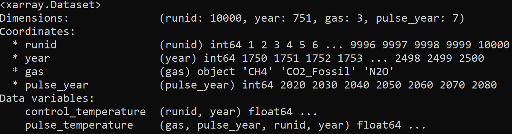
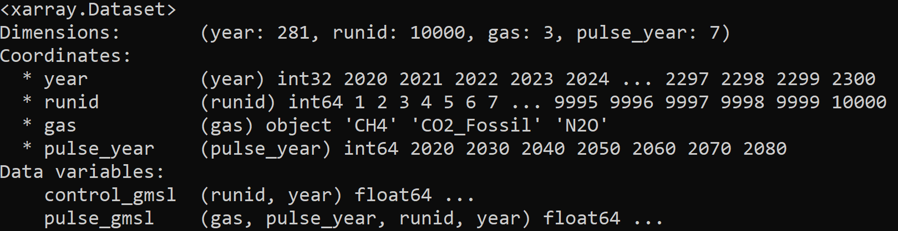
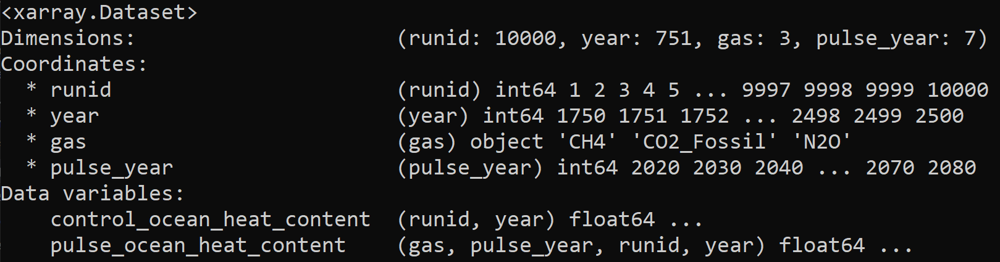

File formats
------------

Formatting your control/pulse input files
^^^^^^^^^^^^^^^^^^^^^^^^^^^^^^^^^^^^^^^^^

Depending on your DSCIM-FACTS-EPA run, you may need to format GMST, GMSL, or OHC control/pulse files. To ensure that both :code:`FACTS` and :code:`dscim-facts-epa` can read new GMST, GMSL, and OHC files, a strict format must be adopted.

.. _GMST:

Formatting GMST control/pulse file
""""""""""""""""""""""""""""""""""

We require that there be a control and pulse version of the appropriate variable. For GMST, these are `control_temperature` and `pulse_temperature`. All control/pulse files must follow the following format: 
1. Any combination of gases and pulse years can be supplied. SC-GHGs will then be runnable for those gases and pulse years. 
2. We expect `year` to be at minimum from 2000-2300. Climate inputs are automatically made relative to 2001-2010 in `dscim-facts-epa` to be consistent with the damage functions. 
3. The `runid` dimension corresponds to the FaIR parameters and RFF-SPs crosswalk specified for EPA's September 2022 draft technical report, "Report on the Social Cost of Greenhouse Gases: Estimates Incorporating Recent Scientific Advances". Thus, each runid is associated with an RFF-SP index and a climate parameter index. We expect 10000 `runids` from 1 to 10000.

An example of the format of this file is found in the image below:

.. _GMSL:

Formatting GMSL control/pulse file
""""""""""""""""""""""""""""""""""

We require that there be a control and pulse version of the appropriate variable. For GMSL, these are `control_gmsl` and `pulse_gmsl`. All control/pulse files must follow the following format: 
1. Any combination of gases and pulse years can be supplied. SC-GHGs will then be runnable for those gases and pulse years. 
2. We expect `year` to be at minimum from 2000-2300. Climate inputs are automatically made relative to 2001-2010 in `dscim-facts-epa` to be consistent with the damage functions. 
3. The `runid` dimension corresponds to the FaIR parameters and RFF-SPs crosswalk specified for EPA's September 2022 draft technical report, "Report on the Social Cost of Greenhouse Gases: Estimates Incorporating Recent Scientific Advances". Thus, each runid is associated with an RFF-SP index and a climate parameter index. We expect 10000 `runids` from 1 to 10000.

An example of the format of this file is found in the image below:

.. _OHC:

Formatting OHC control/pulse file
"""""""""""""""""""""""""""""""""

We require that there be a control and pulse version of the appropriate variable. For OHC, these are `control_ocean_heat_content` and `pulse_ocean_heat_content`. All control/pulse files must follow the following format: 
1. Any combination of gases and pulse years can be supplied. SC-GHGs will then be runnable for those gases and pulse years. 
2. We expect `year` to be at minimum from 2000-2300. Climate inputs are automatically made relative to 2001-2010 in `dscim-facts-epa` to be consistent with the damage functions. 
3. The `runid` dimension corresponds to the FaIR parameters and RFF-SPs crosswalk specified for EPA's September 2022 draft technical report, "Report on the Social Cost of Greenhouse Gases: Estimates Incorporating Recent Scientific Advances". Thus, each runid is associated with an RFF-SP index and a climate parameter index. We expect 10000 `runids` from 1 to 10000.

An example of the format of this file is found in the image below:

.. _config:

Modifying config files
"""""""""""""""""""""""

By default, :code:`dscim-facts-epa` includes a :code:`generated_conf.yml` file which can be used to generate 'default' SC-GHGs (CO2, CH4, and N2O) that replicate the EPA's September 2022 draft technical report. The alternative run processes specify the means to create custom configs that have alternative GMST and GMSL files. Once the custom config is created, the final step is to specify the "pulse conversion" for each gas. This conversion factor converts the final SC-GHG from :code:`$ / pulse size of FaIR gas species` to :code:`$ / tonne of GHG`. 

To do this, modify the `gas_conversions` portion of the config. By default, this is:

.. code-block:: yaml
    gas_conversions:
    CH4: 2.5e-08
    CO2_Fossil: 2.72916487e-10
    N2O: 6.36480131e-07

To add additional gases, create a new line and follow the formatting of the previous lines. New gases should match the coordinate values of your `gas` dimension in your gmst, gmsl, or ohc files. For example, the SCC default pulse size in DSCIM-FACTS-EPA is 1 GtC (1 gigatonne Carbon). To convert to $ / tonne CO2, molecular weights are used to convert C to CO2, and Gt is converted to tonnes: 

.. math::
    \frac{1}{((12+2*16)/12)} \times \frac{1}{1e9} = 2.72916487e-10
